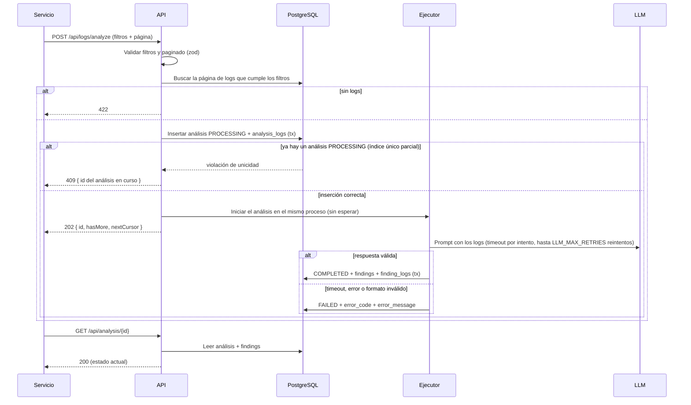

# Secuencia del análisis

Se describe en la sección [Análisis](../../ARCHITECTURE.md#análisis) de `ARCHITECTURE.md`.

```mermaid
sequenceDiagram
    participant S as Servicio
    participant API as API
    participant DB as PostgreSQL
    participant R as Ejecutor
    participant L as LLM

    S->>API: POST /api/logs/analyze (filtros + página)
    API->>API: Validar filtros y paginado (zod)
    API->>DB: Buscar la página de logs que cumple los filtros
    alt sin logs
        API-->>S: 422
    else
        API->>DB: Insertar análisis PROCESSING + analysis_logs (tx)
        alt ya hay un análisis PROCESSING (índice único parcial)
            DB-->>API: violación de unicidad
            API-->>S: 409 { id del análisis en curso }
        else inserción correcta
            API->>R: Iniciar el análisis en el mismo proceso (sin esperar)
            API-->>S: 202 { id, hasMore, nextCursor }
            R->>L: Prompt con los logs (timeout por intento, hasta LLM_MAX_RETRIES reintentos)
            alt respuesta válida
                R->>DB: COMPLETED + findings + finding_logs (tx)
            else timeout, error o formato inválido
                R->>DB: FAILED + error_code + error_message
            end
        end
    end
    S->>API: GET /api/analysis/{id}
    API->>DB: Leer análisis + findings
    API-->>S: 200 (estado actual)
```
