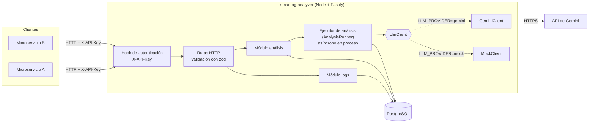

# Vista de componentes

Se describe en la sección [Vista de componentes](../../ARCHITECTURE.md#vista-de-componentes) de `ARCHITECTURE.md`.

```mermaid
flowchart LR
    subgraph Clientes
        S1[Microservicio A]
        S2[Microservicio B]
    end

    subgraph App["smartlog-analyzer (Node + Fastify)"]
        AUTH[Hook de autenticación<br/>X-API-Key]
        ROUTES[Rutas HTTP<br/>validación con zod]
        LOGS[Módulo logs]
        ANA[Módulo análisis]
        RUNNER["Ejecutor de análisis (AnalysisRunner)<br/>asíncrono en proceso"]
        LLM{{LlmClient}}
        GEMINI[GeminiClient]
        MOCK[MockClient]
    end

    DB[(PostgreSQL)]
    GAPI[API de Gemini]

    S1 & S2 -->|HTTP + X-API-Key| AUTH --> ROUTES
    ROUTES --> LOGS
    ROUTES --> ANA
    ANA --> RUNNER
    RUNNER --> LLM
    LLM -.->|LLM_PROVIDER=gemini| GEMINI
    LLM -.->|LLM_PROVIDER=mock| MOCK
    GEMINI -->|HTTPS| GAPI
    LOGS --> DB
    ANA --> DB
    RUNNER --> DB
```
