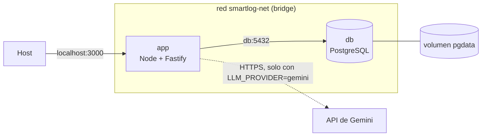

# Contenedores

Se describe en la sección [Contenedores](../../ARCHITECTURE.md#contenedores) de `ARCHITECTURE.md`.

```mermaid
flowchart LR
    HOST[Host] -->|localhost:3000| APP
    subgraph net["red smartlog-net (bridge)"]
        APP[app<br/>Node + Fastify] -->|db:5432| DB[(db<br/>PostgreSQL)]
    end
    DB --- VOL[(volumen pgdata)]
    APP -.->|HTTPS, solo con LLM_PROVIDER=gemini| GEM[API de Gemini]
```
